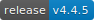

# DNN Azure Active Directory provider
### Latest release [](https://github.com/davidjrh/dnn.azureadprovider/releases/latest)

**Looking for the DNN Azure AD B2C provider? Go to https://github.com/intelequia/dnn.azureadb2cprovider**

## Contents
- [Overview](#overview)
- [Requirements](#requirements)
- [Installation and configuration guide](#installation-and-configuration-guide)
  - [Azure Active Directory setup](#AAD-setup)
  - [DNN Provider installation and configuration](#provider-configuration)
  - [Claim mappings](docs/mappings.md)
- [Building the solution](#building-the-solution)
  - [Requirements](#requirements-1)
  - [Install package dependencies](#install-package-dependencies)
  - [Debug the client side app](#debug-the-client-side-app)
  - [Build the module](#build-the-module)
- [References](#references)

<a name="overview"></a>
## Overview
The DNN Azure Active Directory Provider is an Authentication provider for DNN Platform that uses Azure Active Directory OAuth2 authentication to authenticate users.


<a name="requirements"></a>
## Requirements
* **DNN Platform 9.4.3 or later**

<a name="installation-and-configuration-guide"></a>
## Installation and configuration guide
This guide has two parts:
* How to setup Azure Active Directory
* How to install the authorization provider in our DNN deployment and how to setup the AD parameters we created before

Following this two steps, you will give access to all your Azure AD users to register and sign-in into your DNN application. You can go later and harden your security settings like only allow to access the DNN Web Application to certain users on the Azure portal. Also note that depending on whether you have "Public" or "Private" user account registration on your DNN portal, you will need to approve the registered user before allowing him to access the site.

<a name="AAD-setup"></a>
### Azure Active Directory setup
To support the role and profile synchronization by internally using the Microsoft Graph API, a service principal is needed to call the API. To setup the service principal:

1. Go to https://portal.azure.com to setup the required applications on your Azure Active Directory. You need to use the user credentials of a user with at least "Service Admin" role. 
2. In the left-hand navigation pane, click the Azure Active Directory service, click **App registrations**, and click **New  registration**.
3. When the **Create** page appears, enter your application's registration information:
    * **Name**: Enter a meaningful application name. This can be any name you want and is simply how you will identify the application in your Azure Active Directory (i.e. "My DNN Web Application").
    * **Supported account types**: select the supported account type, typically the first option (Single tenant). If you want to support users from multiple tenants, choose the second option "Multitenant", and if you desire to support Microsoft accounts choose any of the other options.
    * **Redirect URI**: This is the URL where user can sign in and use your app. In a typical DNN site, this should be something like "http://mysite.com/Login". You can change this URL later.
4. <a name="applicationid"></a> When finished, click **Create**. Azure AD assigns a unique **Application ID** to your application, and you're taken to your application's main registration page.
5. Click on the name of the app we've just created and then on "All settings" > "API permissions" > "Microsoft Graph". Ensure that the app has, at least the following API Permissions over the MS Graph API:
    * Delegated
        * offline_access
        * openid    
    * Application
        * Application.Read.All
        * Group.Read.All
        * GroupMember.Read.All
        * User.Read.All   

6. Click on the **Grant permissions** button and then click on "Yes" to grant the permissions in all the accounts in the current directory.
7. <a name="getaadkey"></a> Now on the **Settings** page, under the **keys** section, create a new key with the desired expiration. Click on Save and then copy the key to a secure location. `IMPORTANT: you won't be able to copy this key later, so copy it now or generate a new one when needed.`

<a name="provider-configuration"></a>
### DNN provider installation and configuration
It's important to remember that you need a DNN deployment with **version 7.4.1 or later** for v1.0.1 and **version 9.0.0 or later** for v3.0 to continue. 

1. Download the DNN Azure AD provider from the Releases folder (i.e. AzureADProvider_03.00.00_Install.zip) https://github.com/davidjrh/dnn.azureadprovider/releases
2. Login into your DNN Platform website as a host user and install the provider from the "Host > Extensions" page
3. Use the **Install Extension Wizard** to upload and install the file you downloaded on step 1. Once installed, you can setup the provider from the new settings page, under the section **Azure Active Directory** on the Persona Bar:


The settings page is very straightforward. It only requires three parameters from your Azure AD application:
* **Directory Tenant ID**: You can get this parameter from the **Properties** section of your active directory (it's the value of the field **Directory ID**). If you created the app registration as multitenant, type "common".
* **App ID**: This is the **Application ID** of the application you created in [step 4](#applicationid) of the previous section of this guide
* **Secret**: This is the **Key** that you generated in [step 6](#getaadkey) of the previous section
* **Enabled**: Use this switch to enable/disable the provider
* **Auto-Redirect**: This option allows you to automatically redirect your login page to the Azure AD login page


## Building the solution
### Requirements
* Visual Studio 2022 (download from https://www.visualstudio.com/downloads/)
* npm package manager (download from https://www.npmjs.com/get-npm)

### Install package dependencies
From the comman line, enter the `<RepoRoot>\DotNetNuke.Authentication.Azure\AzureAD.Web` and run the following commands:
```
  npm install -g webpack
  npm install -g webpack-cli
  npm install -g webpack-dev-server --force
  npm install --force
```

### Debug the client side app
To debug the client side, build the module in debug mode and copy the .dll and .pdb files into your site /bin folder (you can tweak the post build event for such purpose). That will try to load the persona bar bundle script from https://localhost:8080. 

The second step is to start the local webpack dev server. To do it, 
From the command line, enter the `<RepoRoot>\DotNetNuke.Authentication.Azure\AzureAD.Web` and run the following commands:
```
  webpack-dev-server
```

### Build the module
Now you can build the solution by opening the DotNetNuke.Authentication.Azure.sln file on Visual Studio. Building the solution in "Release", will generate the React bundle and package it all together with the installation zip file, created under the "\releases" folder.

On the Visual Studio output window you should see something like this:
```
1>------ Rebuild All started: Project: DotNetNuke.Authentication.Azure, Configuration: Release Any CPU ------
1>C:\Program Files (x86)\Microsoft Visual Studio\2017\Enterprise\MSBuild\15.0\Bin\Microsoft.Common.CurrentVersion.targets(2106,5): warning MSB3277: Found conflicts between different versions of "Newtonsoft.Json" that could not be resolved.  These reference conflicts are listed in the build log when log verbosity is set to detailed.
1>  DotNetNuke.Authentication.Azure -> C:\Dev\dnn.azureadprovider\DotNetNuke.Authentication.Azure\bin\DotNetNuke.Authentication.Azure.dll
1>  Hash: 96cf8fcd3ef2c4a72565
1>  Version: webpack 1.13.0
1>  Time: 4922ms
1>         Asset    Size  Chunks             Chunk Names
1>  bundle-en.js  345 kB       0  [emitted]  main
1>      + 43 hidden modules
1>  
1>  WARNING in bundle-en.js from UglifyJs
1>  Condition always false [./~/style-loader/addStyles.js:24,0]
1>  Dropping unreachable code [./~/style-loader/addStyles.js:25,0]
1>  Condition always true [./src/containers/Root.js:2,4]
1>  Dropping unreachable code [./src/containers/Root.js:5,4]
1>  Condition always false [./~/style-loader!./~/css-loader!./~/less-loader!./src/components/general/generalSettings.less:10,0]
1>  Dropping unreachable code [./~/style-loader!./~/css-loader!./~/less-loader!./src/components/general/generalSettings.less:12,0]
1>  Side effects in initialization of unused variable update [./~/style-loader!./~/css-loader!./~/less-loader!./src/components/general/generalSettings.less:7,0]
1>  Condition always false [./~/style-loader!./~/css-loader!./~/less-loader!./src/components/style.less:10,0]
1>  Dropping unreachable code [./~/style-loader!./~/css-loader!./~/less-loader!./src/components/style.less:12,0]
1>  Side effects in initialization of unused variable update [./~/style-loader!./~/css-loader!./~/less-loader!./src/components/style.less:7,0]
========== Rebuild All: 1 succeeded, 0 failed, 0 skipped ==========

```


## References
* Azure Active Directory Part 2: Building Web Applications for Azure AD, Rick Rainey (http://justazure.com/azure-active-directory-part-2-building-web-applications-azure-ad/) 
* What exactly is the App ID URI when adding a new Azure AD Application? https://social.msdn.microsoft.com/Forums/en-US/1bab0034-d01e-431b-9562-b7e9d7b2a180/what-exactly-is-the-app-id-uri-when-adding-a-new-azure-ad-application?forum=WindowsAzureAD
* Integrating applications with Azure Active Directory. https://docs.microsoft.com/en-us/azure/active-directory/develop/active-directory-integrating-applications
